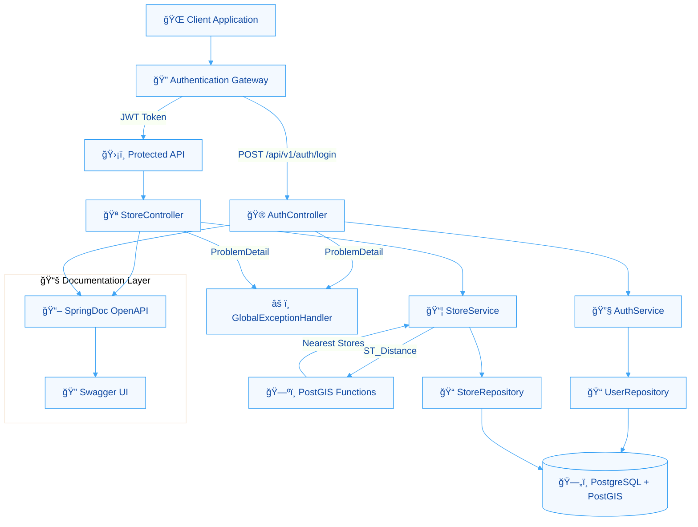
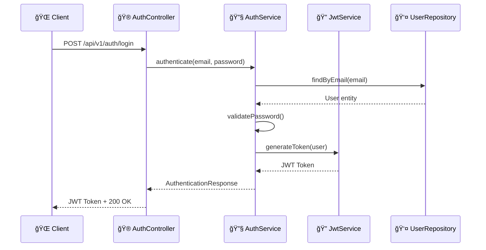
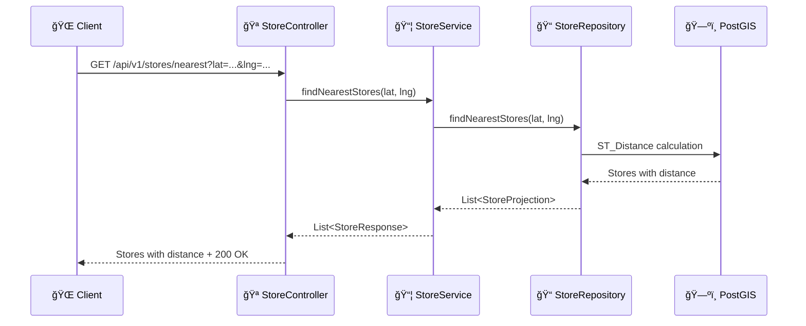

# 🌍 GeoLoc API - Store Location Finder

[](https://github.com/felipenanes/geolocation-tests-study)
[](https://openjdk.java.net/projects/jdk/17/)
[](https://spring.io/projects/spring-boot)
[](#test-coverage)

RESTful API for finding nearest stores based on geographic coordinates with JWT authentication and automatic documentation.

## 🚀 Technologies and Libraries

### **Core Framework**
- **Spring Boot 4.1.0-M1** - Main framework
- **Java 17** - Programming language
- **Spring Security 6** - Authentication and authorization
- **Spring Data JPA** - Data persistence
- **Spring Validation** - Input validation

### **Database & Migration**
- **PostgreSQL** with **PostGIS** - Geospatial database
- **Flyway** - Automatic schema migrations
- **HikariCP** - Connection pool

### **Security & Authentication**
- **JWT (JSON Web Tokens)** - Stateless authentication
- **BCrypt** - Password hashing

### **Geographic & Spatial**

- **PostGIS** - PostgreSQL geographic extension (GIST Index)

### **API Documentation**
- **SpringDoc OpenAPI 2.7.0** - Automatic documentation
- **Swagger UI** - Interactive interface
- **OpenAPI 3.0** - API specification

### **Testing & Quality**
- **JUnit 5** - Testing framework
- **AssertJ** - Fluent assertions
- **Mockito** - Mocking framework
- **Spring Test** - Integration tests
- **Jacoco** - Code coverage
- **Spring Boot Test** - Automated tests

### **Development Tools**
- **Lombok** - Boilerplate code reduction
- **Spring Boot DevTools** - Hot reload
- **Spring Boot Actuator** - Monitoring

## 🏗️ Architecture and Flows



### **🔄 Authentication Flow**



### **🔍 Store Search Flow**



### **🎯 Testing Strategy**

| Type | Framework | Coverage | Examples |
|------|-----------|----------|----------|
| **Unit** | JUnit 5 + Mockito | Individual classes | Services, Controllers, Mappers |
| **Integration** | Spring Boot Test | Complete flows | AuthControllerIntegrationTest |

### **🔧 Jacoco Configuration**

```gradle
jacocoTestReport {
    reports {
        xml.required = true
        html.required = true
    }
}

jacocoTestCoverageVerification {
    violationRules {
        rule {
            limit {
                minimum = 80.0
            }
        }
    }
}
```

## 🗄️ Database Migrations

### **📋 Migration Structure**

```
src/main/resources/db/migration/
├── V1__create_complete_schema.sql     # Initial schema
└── V2__load_stores_data.sql           # Sample data
```

## 📝 Logging

### **🔧 Logging Configuration**

```yaml
logging:
  level:
    org.springframework.security: INFO
    nl.felipenanes.geoloc: INFO
```

### **📊 Logging Structure**

| Component | Level | Information |
|------------|-------|-------------|
| **Security** | INFO | Authentication flows |
| **Business** | INFO | Business operations |
| **Database** | INFO | SQL queries (formatted) |

## 📖 SpringDoc OpenAPI

### **🔍 Automatic Documentation**

- **Swagger UI**: `http://localhost:8080/swagger-ui.html`
- **OpenAPI JSON**: `http://localhost:8080/v3/api-docs`
- **Security Scheme**: Bearer JWT

### **📋 Documented Endpoints**

| Endpoint | Method | Description | Security |
|----------|--------|-----------|----------|
| `/api/v1/auth/login` | POST | User authentication | ❌ Public |
| `/api/v1/stores/nearest` | GET | Find nearest stores | ✅ JWT |

## 🚀 Running the Application

### **🐳 Docker Compose**

```bash
# Start PostgreSQL with PostGIS
docker-compose up -d postgres

# Run application
./gradlew bootRun
```

### **📱 API Access**

- **API Base**: `http://localhost:8080`
- **Swagger UI**: `http://localhost:8080/swagger-ui.html`
- **Health Check**: `http://localhost:8080/actuator/health`

### **📊 Monitoring**

```bash
# Start application with monitoring endpoints
docker-compose up --build

# Access monitoring endpoints
- Health: http://localhost:8080/actuator/health
- Metrics: http://localhost:8080/actuator/metrics
- All Endpoints: http://localhost:8080/actuator
```

**📈 Available Metrics:**

The application exports comprehensive metrics through Spring Boot Actuator:

- **HTTP Metrics**: Request latency, rate, status codes
- **JVM Metrics**: Memory usage, GC performance, threads
- **Database Metrics**: Connection pool, query performance
- **Security Metrics**: Authentication events, filter performance
- **Custom Metrics**: Business operations and events

### **🔐 Authentication**

```bash
# Login
curl -X POST http://localhost:8080/api/v1/auth/login \
  -H "Content-Type: application/json" \
  -d '{"email":"test@test.com","password":"test123"}'

# Use returned token to access protected endpoints
curl -X GET "http://localhost:8080/api/v1/stores/nearest?latitude=52.370216&longitude=4.895168" \
  -H "Authorization: Bearer <JWT_TOKEN>"
```

## 🧪 Testing

### **🏃‍♂️ Run All Tests**

```bash
./gradlew test
```

### **📊 Coverage Report**

```bash
./gradlew jacocoTestReport
# View report at: build/reports/jacoco/test/html/index.html
```

### **🎯 Specific Tests**

```bash
# Authentication tests
./gradlew test --tests "nl.felipenanes.geoloc.auth.*"

# Location tests
./gradlew test --tests "nl.felipenanes.geoloc.locations.*"

# Integration tests
./gradlew test --tests "*IntegrationTest"
```

## 🔧 Configuration

### **📄 Environment Variables**

```yaml
spring:
  datasource:
    url: jdbc:postgresql://localhost:5432/geoloc
    username: postgres
    password: postgres

jwt:
  secret: bWluaGEtY2hhdmUtc2VjcmV0YS1zdXBlci1zZWd1cmEtY29tLTI1Ni1iaXRz
  expiration: 900000
```

### **🔧 Profiles**

- **default**: Development configuration
- **test**: Automated test configuration
- **prod**: Production configuration (to be defined)

---

## 🚀 Future Improvements

### **🔐 Authentication Enhancements**

OAuth2 and LDAP authentication providers are documented in `AuthenticationProviderBundleConfig.java` as future improvements with detailed implementation examples.

### **📱 Mobile & API Enhancements**

- **🔄 Rate Limiting**: Implement request rate limiting (SlidingWindow or Bucketing)
- **📱 Mobile API**: Mobile-optimized endpoints (BFF)
- **🌐 Internationalization**: Multi-language support
- **📊 Analytics**: Usage metrics API

### **🗄️ Database & Performance**

- **📊 Data Analytics**: Metrics dashboards (CPU, TPS, Memory, etc.)

### **📊 Monitoring & Metrics**

- **Prometheus Integration**: Centralized metrics collection and storage
- **Grafana Dashboards**: Professional monitoring visualization
- **Alerting**: Automated notifications for critical metrics
- **Distributed Tracing**: Request flow across services

### **🔒 Security & Compliance**

- **📝 Audit Logging**: Complete audit logs (CrDeUp)
- **🔐 Multi-tenant**: Multi-client support
- **📋 GDPR Compliance**: Privacy compliance
- **📋 Traceability**: Trace-ID (Caller) & Span-ID (Local)

### **🚀 DevOps & Infrastructure**

- **🔄 CI Pipeline**: GitHub Actions (build, test, coverage)
- **📊 Monitoring**: Spring Boot Actuator endpoints
- **🔮 Future**: Prometheus + Grafana integration
- **🔔 Alerts**: Automated notifications

### **🔄 CI Pipeline**

**Triggers:**
- Push to `dev` or `master` branches
- Pull requests to `dev` or `master`

**Jobs:**
- **Test**: Unit + Integration tests with PostgreSQL
- **Build**: Application compilation and packaging
- **Coverage**: Jacoco reports 80% Ruling

**Purpose:**
- Validate code quality before merging
- Ensure all tests pass
- Generate coverage reports
- Prevent broken code in main branches

---

**🌍 GeoLoc API - Finding the nearest stores to you!**
